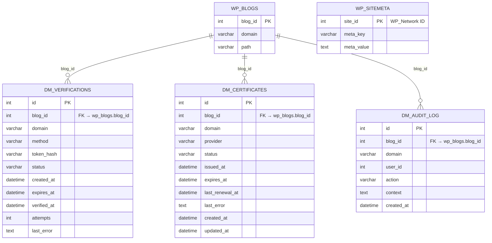

# Domain Mapping System for WordPress Multisite – Developer Specification

## Executive Summary  
This document specifies a WordPress Multisite **Domain Mapping System** plugin built for WordPress **6.x (6.4+)** and PHP **8.1+**.  Modern WordPress (since 4.5) already supports mapping custom domains via the Network Admin **Site Address (URL)** field.  This plugin formalizes that functionality into a robust service: it **does not use a Custom Post Type** for mappings, avoids legacy *sunrise.php* hacks, and instead leverages core multisite tables.  The canonical **domain→site** mapping is stored in `wp_sitemeta` (network-level site metadata), inspired by Human Made’s Mercator approach.  Three custom tables handle **verification**, **certificate metadata**, and **audit logs**, as mapping records themselves belong in `wp_sitemeta`.  The plugin exposes a dedicated REST namespace (`domain-mapping/v1`) and WP-CLI commands, all using a shared service layer.  TLS/SSL integration (e.g. ACME/Let’s Encrypt) is **optional**; the system provides hooks but assumes hosting/DNS is managed externally.  Key decisions (no mapping CPT, use `wp_sitemeta`, etc.) are enforced in the agent spec.  This spec includes architecture diagrams (ER and flows), detailed schemas, API and CLI contracts, UI/permissions notes, testing/security guidelines, migration path (including Mercator compatibility), and implementation roadmap.

## Goals, Scope, and Non-Goals  
**Goals:** The plugin will allow network administrators to **add, verify, enable, and remove custom domains** that map to existing multisite subsites (blogs).  Mapped domains become alternate addresses for a site (blog), with optional domain ownership verification (DNS or file challenge) and TLS certificate management via pluggable providers.  A REST API (`domain-mapping/v1/*`), WP-CLI commands, and Network Admin pages enable all operations.  The system keeps a complete audit trail.  

**Scope:** The scope covers domain-to-blog mapping **only**.  For each mapping it stores state (proposed, verified, enabled), supports verification workflows, and can integrate with external TLS services.  It handles subdomain or subdirectory networks.  The plugin will be network-activated (or MU-activated) and will **not** require a custom `sunrise.php` file; it hooks into core early instead.  It will be internationalized, following WordPress coding standards, and include unit/integration tests.  

**Non-Goals:** This plugin will **not** provide editorial domain-to-content mapping (no CPTs for domains, no microsites as separate posts).  It will not attempt to modify DNS or webserver configurations automatically.  It will not assume control of ports or certificates on the server; rather it provides an API for **optional** TLS integration.  It will not retrofit non-networked WordPress (single-site) – it is strictly Multisite.  In short, it manages the *configuration* of alias domains, not the external infrastructure. 

## Architecture Overview  

We use WordPress’s native multisite tables for the core mapping and separate tables for operational data.  The ER diagram below illustrates the relationship among key tables:



**Flow of an incoming request:** When an HTTP request arrives, the plugin intercepts early (pre-`parse_request`). A flowchart of request handling is:

```mermaid
flowchart TD
    Req[Incoming HTTP Request] --> Check{Known Domain?}
    Check -- Alias Domain --> Lookup[Query wp_sitemeta for domain meta_key]
    Lookup -->|Found| MappedSite[Get mapped blog_id]
    MappedSite --> Switch[Switch to blog context (switch_to_blog)]
    Switch --> Serve[Load and serve site content]
    Check -- Not Alias --> Normal[Serve via primary network domain]
```

1. **DNS & Request:** The custom domain must point (DNS A/CNAME) to the Multisite server.  (WordPress docs note all mapped domains should be *parked* on the network’s host.)  
2. **Lookup:** The plugin looks up the domain in `wp_sitemeta` (meta_key = e.g. `dm_domain_example.com`) to find the associated blog ID.  
3. **Blog Switch:** If found and active, it calls `switch_to_blog($blog_id)` so WordPress loads that site’s tables and settings under the custom domain.  
4. **Fallback:** If not found or mapping disabled, the request proceeds normally.  

This tight integration with core means we do *not* rewrite admin URLs via post-processing: WordPress’s own login/auth handling (with `COOKIE_DOMAIN=$_SERVER['HTTP_HOST']` as needed) handles multi-domain logins.  

## Data Model  

### Canonical Domain→Site Mapping (in `wp_sitemeta`)  
- **Table:** `wp_sitemeta` (network-level metadata).  
- **meta_key Format:** `dm_domain_{normalized_domain}` (e.g. `dm_domain_example.com`).  Normalization lowercases and strips protocol/`www`. (Configurable prefix via a constant/filter).  
- **meta_value:** The **blog ID** (integer) of the mapped site. For example, if blog ID 123 should respond to example.com, we insert `(site_id = <network ID>, meta_key='dm_domain_example.com', meta_value='123')`.  
- **site_id column:** The network ID (wp_blogs.site_id) where the mapping applies (usually 1 for single-network setups).  

This follows Mercator’s design of using `wp_sitemeta` for domain mappings.  It ensures the domain→blog link is indexed by WordPress’s cache and query system. Only one mapping should exist per domain key (unique key constraint on `meta_key`). If a mapping is disabled or removed, the record can be deleted or updated.  

### Custom Tables  

We use **three custom tables** (each name prefixed by `wp_dm_`, where `wp_` is the table prefix):

1. **`wp_dm_verifications`** – Tracks domain ownership challenges:  
   - `id` (PK, bigint, auto-increment)  
   - `blog_id` (bigint) – FK to `wp_blogs.blog_id`.  
   - `domain` (varchar) – The domain under verification (redundant but convenient).  
   - `method` (varchar) – Verification method (`dns`, `http`, etc).  
   - `token_hash` (varchar) – A one-way hash of the verification token (do **not** store raw tokens).  
   - `status` (enum/varchar) – e.g. `pending`, `verified`, `failed`.  
   - `created_at`, `expires_at`, `verified_at` (datetime).  
   - `attempts` (int) – Number of tries.  
   - `last_error` (text) – Last error message if failed.  

   **Indexes:** (`blog_id`), (`domain`), (`status`), for quick lookups.  
   We sanitize domains (`sanitize_text_field`) and hash tokens (e.g. `hash('sha256', $token)`) before inserting.

2. **`wp_dm_certificates`** – Stores certificate metadata (not keys):  
   - `id` (PK)  
   - `blog_id` (bigint) – FK to `wp_blogs.blog_id`.  
   - `domain` (varchar) – The domain for the cert.  
   - `provider` (varchar) – Issuer or mechanism (`none`, `letsencrypt`, `manual`, `cloudflare`, etc).  
   - `status` (enum/varchar) – `none`, `pending`, `issued`, `expired`, `error`.  
   - `issued_at`, `expires_at`, `last_renewal_at` (datetime).  
   - `last_error` (text) – Any error from the provider.  
   - `created_at`, `updated_at` (datetime).  

   **Note:** **Private keys or full cert data are *not* stored here.** The plugin provides hooks/abstraction for external storage (filesystem or secret store). We only track status and metadata to know if a cert needs renewal.  

3. **`wp_dm_audit_log`** – Records actions for audit/troubleshooting:  
   - `id` (PK)  
   - `blog_id` (bigint) – FK to `wp_blogs.blog_id` if applicable.  
   - `domain` (varchar) – Domain context (if any).  
   - `user_id` (bigint) – WP user performing the action (can be 0 for automated tasks).  
   - `action` (varchar) – E.g. `mapping.create`, `mapping.enable`, `verify.request`, `cert.issue`, `mapping.remove`, etc.  
   - `context` (text) – JSON string of any relevant data (old vs new state, etc).  
   - `created_at` (datetime).  

   **Indexes:** (`blog_id`), (`domain`), (`user_id`).  

**Note on Primary vs Active Mapping:** We do **not** store an explicit `is_primary` flag in the mapping record. Instead, the plugin will update the site’s **primary URL** (`wp_blogs.domain` + `path`) when a new primary mapping is set. This leverages WP core’s behavior: for a multisite site, its blog_id entry in `wp_blogs` holds the canonical domain/path.  That way, the mapped domain becomes the “primary” URL automatically. (For example, setting a mapping as primary triggers `wp_update_site` or direct DB update of `wp_blogs.domain`.) Verified-but-not-active domains remain in metadata but are not used for serving.  

### Schema Summaries  

| Table              | Key Columns                                | Notes                                      |
|--------------------|--------------------------------------------|--------------------------------------------|
| **wp_sitemeta**    | `site_id` (network), `meta_key` (domain), `meta_value` (blog_id)  | Authoritative mapping. `meta_key = dm_domain_<domain>`; `meta_value = <blog_id>`. |
| **wp_dm_verifications** | `id` (PK), `blog_id` (FK), `domain`, `token_hash`, `status` | Ownership challenge tracking; store only hash of secret. |
| **wp_dm_certificates**  | `id` (PK), `blog_id` (FK), `domain`, `provider`, `status`    | TLS cert status; no private key.          |
| **wp_dm_audit_log**     | `id` (PK), `blog_id`, `domain`, `user_id`, `action`, `context` | Action log for all mapping/cert events.    |

All text fields use appropriate length (domains ~255 chars). Date/times stored in UTC (WP timezone-neutral). We will use `$wpdb->prepare()` for any custom SQL and wrap multiple updates in transactions where possible to maintain consistency.  

## REST API Specification  

All endpoints are under namespace **`/wp-json/domain-mapping/v1`** and require authentication with proper capabilities (see Permissions below). Responses use JSON with standardized HTTP codes (200, 201, 400, 401, 403, 404, 500). Error responses follow the format `{ "code": "...", "message": "...", "data": { ... } }`. 

**Endpoints:**  

- `GET /mappings`  
  - *Description:* List all domain mappings (optionally filtered by site or status).  
  - *Query Params:* `site_id` (int, optional) to list only mappings for one site.  
  - *Response:* `[{ "id": <meta_id>, "domain": "example.com", "blog_id": 123, "active": true, "verified": true, "primary": false }, ...]`.  

- `POST /mappings`  
  - *Description:* Create a new domain mapping for a site.  
  - *Body (JSON):* `{ "site_id": <blog_id>, "domain": "alias.com", "make_primary": false }`.  
    - *Behavior:* Validates inputs; checks domain format; ensures DNS/A record exists (optional check). Inserts `wp_sitemeta`. Creates an audit log. If `make_primary`, also update site’s primary domain. Initially sets status = pending verification if required by policy.  
  - *Response:* `201 Created` with created mapping object or `WP_Error`.  

- `GET /mappings/{id}`  
  - *Params:* Mapping ID (the sitemeta ID).  
  - *Response:* Details of the mapping `{ "id":123, "domain":"...", "blog_id":45, "active":true, "verified":true, ... }` or 404 if not found.  

- `PATCH /mappings/{id}`  
  - *Body:* Partial update, e.g. `{ "active": true }` or `{ "make_primary": true }`.  
    - Can enable/disable a mapping. If `make_primary` true, demote any other primary.  
  - *Response:* `200 OK` with updated data or error.  

- `DELETE /mappings/{id}`  
  - *Description:* Remove a domain mapping.  
  - *Response:* `200 OK` or error. The mapping is deleted from `wp_sitemeta`.  

- `POST /mappings/{id}/verify`  
  - *Description:* Initiate or retry verification for a mapping.  
  - *Behavior:* Creates/updates a `dm_verifications` record with a new token (hashed). Returns `{ "token": "<plaintext_token>", "method": "http-01" }` if using HTTP challenge, for example.  
  - *Response:* `200 OK` (token details) or error if not allowed.  

- `POST /mappings/{id}/set-primary`  
  - *Description:* Mark an existing verified mapping as the **primary** domain.  
  - *Behavior:* Updates `wp_blogs` for the site to use this domain as the canonical URL, updates sitemeta flags.  
  - *Response:* `200 OK` or error.  

- `GET /sites/{site_id}/mappings`  
  - *Description:* List mappings for a specific site.  
  - *Response:* Array of mapping objects (same format as above).  

**Authentication & Permissions:** All routes require the user to be logged in and have **manage_network** or a custom capability (see Permissions below). For some actions (like verifying, issuing certs), only Super Admin should proceed. 

**JSON Schemas (Examples):**  
- *Mapping object:*  
  ```json
  {
    "id": 123,
    "domain": "alias.com",
    "blog_id": 5,
    "active": true,
    "verified": false,
    "primary": false
  }
  ```  
- *Verification response:*  
  ```json
  {
    "domain": "alias.com",
    "token": "XYZabc123",
    "method": "http-01",
    "challenge_path": ".well-known/acme-challenge/"
  }
  ```  

**Error Codes:**  
- `400 Bad Request` – Validation errors (e.g. invalid domain).  
- `401 Unauthorized` – Not logged in.  
- `403 Forbidden` – Insufficient capabilities or action not allowed (e.g. trying to modify another site’s mapping as non-admin).  
- `404 Not Found` – Mapping or site ID not found.  
- `500 Internal Error` – Unexpected failures.

*All database updates must use `$wpdb->prepare()` to avoid injection. Input is sanitized (e.g. `sanitize_text_field($domain)`) and output escaped with `rest_ensure_response()` and appropriate escapers.*

## WP-CLI Commands  

We provide `wp dm` commands to mirror the REST API:

- `wp dm mapping add <domain> --site=<blog_id> [--primary]`  
  Create a mapping. Example: `wp dm mapping add alias.com --site=5 --primary`. Prints success or WP_Error.  

- `wp dm mapping list [--site=<id>] [--format=json]`  
  List mappings, optionally filtering by `--site=`.  

- `wp dm mapping enable <id>` / `wp dm mapping disable <id>`  
  Enable or disable a mapping by meta ID.  

- `wp dm mapping remove <id>`  
  Delete mapping.  

- `wp dm mapping verify <id> [--force]`  
  Generate a new verification token for mapping ID. Outputs token and instructions.  

- `wp dm mapping set-primary <id>`  
  Make mapping primary for its site.  

- `wp dm cert issue <domain> [--site=<id>]`  
  (Optional) Trigger certificate issuance for a domain. Uses configured provider (e.g. `letsencrypt`).  

- `wp dm cert renew <domain>`  
  Renew certificate.  

- `wp dm audit tail [--site=<id>]`  
  Stream audit log for debugging.

These commands should print JSON or text based on `--format` flag and honor network context (`--network` if multisite, though plugin is network-specific).  They check the current user is a Super Admin (`is_super_admin()`) or has `manage_network` to prevent unauthorized use.  

**Example:** `wp dm mapping add example.org --site=3 --porcelain` would create the mapping and output just the new mapping ID. WP-CLI commands should internally call the same service functions used by REST/UI.

## Admin UI and Permissions  

### Network Admin Screens  
Under **Network Admin → Domains** (or **Sites → Edit → Domain Mapping**), provide UI to list and manage mappings: 

- **Domain Mappings Table:** Columns: *Site (Blog)*, *Mapped Domain*, *Status* (Pending, Verified), *Primary?*, *Actions*. Buttons for *Edit* (to add/remove), *Verify*, *Set Primary*, *Delete*. Each row is a mapping.  

- **Add Mapping Form:** Inputs: *Select Site* (dropdown of sites), *Domain*, *Make Primary (checkbox)*. Validation on submit.  

- **Site-Specific View:** Optionally, on a site’s edit page there could be a “Domain Mappings” meta box showing that site’s mappings (read-only for non-admins) and a button linking back to network UI.  

We will use `add_submenu_page()` for the main interface, and WP List Tables for the mapping lists.  JavaScript (React or vanilla) can be used to call the REST API for dynamic actions (verify, set primary). 

### Capability Matrix  

| Action                             | Role           | Capability Check             |
|------------------------------------|----------------|------------------------------|
| View all mappings                  | Super Admin    | `is_super_admin()`           |
| Add/Edit/Delete mappings           | Super Admin    | `is_super_admin()`           |
| Map site address (primary)         | Super Admin    | `is_super_admin()`           |
| View mappings (own site only)      | Site Admin     | If enabled via filter (see below) |
| Verify domain / Issue cert         | Super Admin    | `is_super_admin()`           |
| View audit log                     | Super Admin    | `is_super_admin()`           |

By default, only **Super Admins** (network administrators) can manage mappings, since these are global settings. We will provide a filter (e.g. `apply_filters('dm_allow_site_admin_mapping', false, $site_id)`) to optionally allow site admins to manage their own site’s mappings. All REST and CLI endpoints enforce these checks. WP nonces will be used in forms and REST to protect against CSRF.

## Service Layer Design  

We follow a modular *service pattern*. The core PHP class (e.g. `DomainMappingService`) offers methods:

- `add_mapping( int $blog_id, string $domain, bool $make_primary = false )`  
- `remove_mapping( int $mapping_id )`  
- `enable_mapping( int $mapping_id )`, `disable_mapping()`  
- `list_mappings( int $blog_id = null )`  
- `get_mapping( int $mapping_id )`  
- `set_primary( int $mapping_id )`  
- `generate_verification( int $mapping_id, string $method )`  
- `verify_mapping( int $mapping_id, string $token )`  

These operate on the shared data layer (wpdb).  All UI, REST callbacks, and CLI commands call these methods (no duplicate logic).  Data validation and sanitization occur at service boundaries. Errors are returned as `WP_Error` objects where appropriate.

### Verification Workflow  
When a mapping is added or upon explicit request:

1. **Create a challenge:** Generate a random token/secret, hash it, and insert a row in `wp_dm_verifications` with status `pending`.  
2. **Return instructions:** For HTTP-01, return a URL path and token; for DNS-01, return a TXT record name/value.  
3. **User Action:** The site owner must place the token at the specified location (upload file or add DNS TXT).  
4. **Confirm:** The plugin (upon user pressing “Complete Verification” or via a scheduled cron) fetches/verifies the challenge. If success, it marks status `verified` and records `verified_at`. If failed, status `failed` and logs `last_error`.  
5. **State Transition:** Only after `verified` can the mapping be *activated*. Activation simply means enabling and (if chosen) updating the blog’s primary domain.  

Verification tokens are hashed in the DB so that even DB read cannot reveal them. We clear or expire tokens after one use. (Use PHP’s `hash_hmac('sha256', $token, AUTH_KEY)` for example.)  The user flow is made clear in the admin UI with instructions and status indicators. 

### Certificate Integration (TLS Abstraction)  
We define an abstraction layer for TLS. Out of the box, the core plugin does **not** automatically issue certificates. Instead, it:  

- Provides a `CertificateProviderInterface` with methods `issue_certificate($domain)` and `renew_certificate($domain)`.  
- A default *Manual* provider does nothing (status remains `none`).  
- An optional *ACME* provider can use e.g. [acme-client](https://github.com/kelunik/acme-client) or the `letsencrypt.com` API to request a cert.  
- Hooks allow registration of other providers, e.g. Cloudflare API (to set DNS and request cert).  

The certificate provider updates `wp_dm_certificates` (status, issued/expiry dates) but never stores private keys in the DB. We encourage storing certs/keys in the filesystem or via `openssl` calls, outside WP. (Let’s Encrypt docs advise **reusing** existing certs instead of reissuing for each request, to avoid rate limits.) The plugin will also schedule daily *health checks*: verify each active domain resolves (DNS lookup) and check cert validity/expiration, logging any issues in `dm_audit_log`. 

### Caching Strategy  
Domain lookups are critical in request flow. We will use the WordPress object cache: upon reading `wp_sitemeta` for a domain, store it with keys like `dm_domain_{domain}` (see Mercator code [17†L39-L48]). Subsequent requests can skip the DB. We must invalidate cache on changes (we call `wp_cache_delete` after updates) to avoid stale mappings. Verification/certificate data can use transient caching if needed, but these tables are small.  

## Security, Privacy, and Secrets Handling  

- **Credentials & Secrets:** No sensitive secret (challenge token, private key) is stored in plaintext. We hash tokens (`token_hash`) and never log them. Certificate private keys must remain outside the WordPress DB; any integration must secure them (e.g. filesystem with restricted permissions).  
- **Capabilities:** All data modifications require proper capability checks. Default is **Super Admin** (`is_super_admin()`). We check these in REST endpoints and CLI. We use nonces on forms and `wp_send_json_error()` for invalid nonce.  
- **Input Validation:** Domain names are sanitized with `sanitize_text_field()` and validated (regex or `FILTER_VALIDATE_DOMAIN`). We ensure domains include only allowed characters.  
- **Output Escaping:** Any user-entered domain is escaped with `esc_url()` or `esc_html()` before rendering in the admin. JSON responses are returned via `wp_kses_post()` or REST escaping.  
- **Database Safety:** Use `$wpdb->prepare()` for all custom queries. Where possible, use WP functions like `add_site_meta()` (or `update_blog_option()`) as wrappers. When altering `wp_blogs` for primary domain, use `wp_update_site()` or `$wpdb->update` with `prepare`. Wrap complex operations in SQL transactions.  
- **Privacy:** Mapped domains and verification tokens could be considered sensitive. We will comply with privacy: do not log personal info. For audits, avoid logging full token or private data. All timestamps and actions are recorded per WP’s data retention guidelines.  
- **HTTPS Defaults:** We encourage HTTPS by default. The admin UI for adding a mapping should note WP docs advice: *“Every domain should have SSL… use SNI for others”*. We do not force HTTPS at application level, but note that modern WordPress logins should occur over HTTPS on each domain.  

## Testing Plan  

We will deliver automated tests covering:  
- **Unit Tests:** For the DomainMappingService class (Mock `$wpdb`). Test adding, removing, conflicting domains, state transitions. Use PHPUnit with WordPress’s testing suite (`WP_UnitTestCase`).  
- **Integration Tests:** In a real WP multisite sandbox (WP `tests/phpunit/`). Test full flows: REST endpoints (with `WP_REST_Request`), WP-CLI commands, and network queries.  
- **WP-CLI Tests:** Using WP CLI’s own testing harness, simulate invoking the `wp dm` commands with various flags.  
- **REST API Tests:** Use `WP_UnitTestCase`’s REST API helpers to check that endpoints require auth and return correct schemas.  
- **Multisite Scenarios:** Test both subdomain and subdirectory networks. Test switching between sites (`switch_to_blog`) ensures correct content on mapped domain.  
- **Security Tests:** Verify no SQL injection (try adding malicious domain), CSRF protection (nonce checks), permission enforcement (site admin cannot map other site’s domain).  
- **Dependency Versions:** Although targeting WP6.x & PHP8.1, include tests on the lowest minor in 6.x (6.0) and PHP8.1 to ensure compatibility.  

All new code will be code-reviewed for adherence to WordPress Coding Standards (PHPCS) and include DocBlocks. We will also audit for performance (e.g. ensure no unbounded loops on admin pages).

## Migration Strategy (Four-Table → Hybrid)  

If replacing an existing 4-table design, we will include a migration routine:

- **Legacy Tables:** Suppose the old plugin used tables `wp_domain_mappings` (with columns `id, blog_id, domain, is_primary, active`), `wp_domain_verifications`, `wp_certificates`, `wp_mapping_logs`. We will write a migration script (on `update.php`) that:  
  - Reads each row in `wp_domain_mappings`, and for each domain:  
    - Inserts into `wp_sitemeta` with `dm_domain_{domain}` as key and `blog_id` as value.  
    - Writes an equivalent `dm_audit_log` entry (`action = migrate.mapping`).  
  - Migrates existing verifications and certificates data into the new tables (columns may map directly).  
  - Drops or renames the old tables (e.g. rename with `_old` suffix).  

- **Mercator Compatibility:** Mercator stores mappings in `wp_sitemeta` under `mercator_{sha1(domain)}` keys with serialized values. To migrate Mercator users, the plugin can recognize Mercator meta_keys on activation:  
  1. Query `wp_sitemeta` for keys `LIKE 'mercator_%'`.  
  2. For each, unserialize, extract `domain` and `active` (mercator data had domain and active).  
  3. Insert a new key `dm_domain_{domain}` with the blog ID (Mercator’s class may have metadata to link network mapping to site).  
  4. Delete Mercator meta_key or ignore it.  
  5. Log in audit (`migrate.mercator`).  

  **Compatibility Note:** After migration, Mercator plugins (if still present) should be deactivated. Our hybrid design avoids the 4-table issues Mercator fixed (no custom mapping table needed), but we maintain data continuity.

## Deployment and Hosting Considerations  

- **Multisite Activation:** The plugin is **Network-activated**. It must run at `mu-plugin` or early `init` to hook domain resolution (instead of `sunrise.php` which is older pattern). Provide instructions to network admins to activate on the **Network**, not per-site.  

- **No Server Privileges:** The plugin **will not** attempt to modify DNS records, Nginx/Apache configs, or firewall rules. Administrators must ensure that:  
  - The custom domain’s DNS A or CNAME record points to the multisite server.  
  - The hosting environment (cPanel/Plesk, Nginx vhost, or cloud DNS) has the domain *parked* or aliased to the WordPress install. (As WordPress docs note: “parked upon the master domain”.)  
  - Ports 80 and 443 are reachable (Let’s Encrypt requires inbound 80 for http-01, outbound 443).  

- **Hosting Integrations:** For TLS automation, we recommend:  
  - **Let’s Encrypt:** Use DNS-01 challenge via Cloudflare API or cPanel hooks. (For ACME, ports and DNS must be open.)  
  - **Hosting APIs:** On providers like WP Engine or Kinsta, consider adding an integration module that calls their domain/CNAME APIs. This is out-of-scope for core plugin but we provide hooks (`do_action('dm_hosting_register_integration')`).  
  - **Cache/CDN:** If behind CDN (Cloudflare/CloudFront), ensure the CDN respects host headers for multisite. Domain mapping should work transparently, but document to purge caches if changing mapping.  

- **Autoscale & DNS:** Warn that dynamic scaling (e.g. containers) can complicate HTTP-01. The integration guide suggests using a central validation or DNS method in such cases.  We provide both http-01 and dns-01 workflows.  

- **Servers Without IPv4:** If the primary domain is IPv6-only, LE http-01 challenges may fail; dns-01 is recommended.  

## Coding Standards and Performance  

- **PHP & WordPress Standards:** All code will be PHP 8.1+, using strict types and namespaces (e.g. `namespace WPDM;`). Functions and methods will use type hints (`function foo(int $a): ?string`). Follow [WordPress PHP coding standards](https://developer.wordpress.org/coding-standards/wordpress-coding-standards/php/). Use `WP_DEBUG` for logging in development only.  
- **Database Access:** Minimize direct SQL. Use `wpdb` methods or WP API when possible. For custom tables, use `$wpdb->insert`, `$wpdb->update`, `$wpdb->delete` with `prepare()` formats. Example:  
  ```php
  $wpdb->insert($wpdb->sitemeta, 
    ['site_id'=>$network_id, 'meta_key'=>$key, 'meta_value'=> (string)$blog_id],
    ['%d','%s','%s']
  );
  ```  
  (Always use `%d, %s` placeholders.)  
- **Transactions:** For operations affecting multiple tables (e.g. setting primary: updating `wp_blogs` and `wp_sitemeta`), wrap in `START TRANSACTION; ... COMMIT;` via `$wpdb->query()`. If an error occurs, `ROLLBACK`. This ensures atomic updates.  
- **WP Functions:** Use `update_site_option()`, `delete_site_meta()`, etc., when applicable. (e.g. `update_site_meta($network_id, $meta_key, $blog_id)`). For switching site context, use `switch_to_blog($blog_id)` and `restore_current_blog()`.  
- **Performance:** The domain lookup should be O(1) with cache. Indexes on `dm_verifications(domain)`, `dm_certificates(domain)` ensure lookups by domain or blog are fast. Batch operations (like health checks) should iterate in manageable chunks. Use `WP_Cron` for periodic tasks (e.g. daily renewal check).  
- **Code Reviews:** All new classes/functions will have PHPDoc blocks, short lines (<80 char). Follow PSR-4 autoloading if using Composer for libraries (e.g. an ACME client).  

## Compatibility and Upgrade Path  

- **WordPress:** Plugin is guaranteed compatible with WP 6.0+ (6.x branch). On activation, it checks `get_bloginfo('version') >= 6.0` and PHP >= 8.1, aborting with an admin notice if unmet. It uses core functions only from WP 5.8+ (like `wp_get_network()`, which exists long before).  
- **PHP:** Requires PHP 8.1+ for typed properties. We will avoid deprecated features. We may allow PHP 8.0 if absolutely needed, but targeted baseline is 8.1.  
- **Multisite Types:** Works for both subdomain (`site1.example.com`) and subdirectory (`example.com/site1`) network setups. Domain mapping logic does not depend on network type.  
- **Upgrade Path:** For future WP versions (6.x upgrades), no special compatibility code is needed, but avoid `old_xxx` functions. If WordPress core introduces new domain mapping hooks or deprecates older ones, update accordingly. We keep automatic migration paths for our own data schema in `db_version`.  

## Example Code Snippets  

Here are illustrative snippets showing the style and API use:

- **Service Layer (Adding a Mapping):**  
  ```php
  public function add_mapping(int $blog_id, string $domain, bool $make_primary = false): int {
      global $wpdb;
      $normalized = sanitize_text_field(strtolower($domain));
      // Check for existing mapping
      $exists = $wpdb->get_var( $wpdb->prepare(
          "SELECT COUNT(*) FROM {$wpdb->sitemeta} WHERE meta_key = %s AND site_id = %d",
          'dm_domain_'.$normalized, $this->network_id
      ) );
      if ($exists) {
          return new WP_Error('dm_domain_exists', 'Domain is already mapped');
      }
      // Insert mapping
      $wpdb->insert(
          $wpdb->sitemeta,
          [
             'site_id'    => $this->network_id,
             'meta_key'   => 'dm_domain_' . $normalized,
             'meta_value' => (string)$blog_id,
          ],
          ['%d','%s','%s']
      );
      if ($wpdb->insert_id === false) {
          return new WP_Error('dm_insert_failed', 'Failed to insert domain mapping');
      }
      // Optionally set as primary
      if ($make_primary) {
          $this->set_primary($wpdb->insert_id);
      }
      // Log audit
      $this->log_action($blog_id, $normalized, 'mapping.create', ['make_primary'=>$make_primary]);
      return (int)$wpdb->insert_id;
  }
  ```

- **REST Controller Registration:**  
  ```php
  add_action('rest_api_init', function () {
      register_rest_route('domain-mapping/v1', '/mappings', [
          'methods'  => 'POST',
          'callback' => 'wpdm_rest_create_mapping',
          'permission_callback' => function() {
              return current_user_can('manage_network');
          },
      ]);
  });
  function wpdm_rest_create_mapping(WP_REST_Request $req) {
      $site = $req->get_param('site_id');
      $domain = $req->get_param('domain');
      $result = DomainMappingService::get_instance()->add_mapping($site, $domain, $req->get_param('make_primary', false));
      if (is_wp_error($result)) {
          return new WP_REST_Response($result, 400);
      }
      return new WP_REST_Response(['id'=>$result], 201);
  }
  ```

- **Reading a Mapping from `wp_sitemeta`:**  
  ```php
  public function get_mapping(int $mapping_id) {
      global $wpdb;
      $row = $wpdb->get_row( $wpdb->prepare(
          "SELECT * FROM {$wpdb->sitemeta} WHERE meta_id = %d", $mapping_id
      ) );
      if (!$row) {
          return null;
      }
      // Ensure key prefix
      if (strpos($row->meta_key, 'dm_domain_') !== 0) {
          return new WP_Error('dm_invalid_id', 'Not a domain mapping record');
      }
      return [
          'id' => (int)$row->meta_id,
          'blog_id' => (int)$row->meta_value,
          'domain' => substr($row->meta_key, 10), // remove prefix
      ];
  }
  ```

- **Using $wpdb->prepare():** All queries that include variable data must use `$wpdb->prepare()`. For example, deleting a mapping:
  ```php
  $wpdb->delete(
      $wpdb->sitemeta,
      ['meta_id' => $mapping_id],
      ['%d']
  ); // safe because we passed format
  ```

These snippets show the style: typed parameters, WP core functions, and prepared statements.

## Implementation Roadmap  

| Phase          | Tasks                                                          | Effort   | Deliverables                          |
|----------------|----------------------------------------------------------------|---------|---------------------------------------|
| **Setup/Scaffolding** | Boilerplate plugin structure, dependency management. Create DB tables and version check. | Low     | Plugin skeleton, activation hook, table creation SQL. |
| **Core Mapping CRUD**  | Implement service for add/get/remove mapping; integrate with `wp_sitemeta`. Add REST and CLI for basic mapping. | Medium  | CRUD API endpoints, CLI commands, service methods. |
| **Verification Flow**  | Build `dm_verifications` table logic. Generate/verifier tokens, REST/CLI endpoints, UI integration for verification status. | Medium  | Verification challenge screens, API, DB updates. |
| **Primary Domain Logic** | Implement setting primary domain (update `wp_blogs.domain`). Handle conflicts, REST/CLI `set-primary`. | Low     | Primary domain update code, tests. |
| **UI/UX**             | Network Admin pages (list/add mapping, verify, audit view). Wireframe and code admin screens. | High    | Admin menu, forms, Javascript for async calls. |
| **Certificate Abstraction** | Define interface, dummy provider; (optional) integrate ACME lib or mock. Add `dm_certificates` handling. | Medium  | Certificate table, scheduling hooks. (ACME provider plugin optional.) |
| **Testing & QA**      | Write PHPUnit tests (unit + REST). Test multisite flows manually. Fix bugs. | High    | Comprehensive test suite, documentation. |
| **Migration Support** | Code migration paths for legacy 4-table and Mercator data. Include update routines. | Low     | Migration scripts, docs for upgrading. |
| **Documentation**     | Finalize inline docs, README, admin help tab. Release notes. | Low     | Developer and admin docs with references. |

Effort is qualitative (Low/Med/High). Overall, an initial MVP (mapping CRUD + verify) is achievable in a few person-weeks; UI polishing and full TLS integration add complexity. We should milestone **Data Model & API** first, then **Verification**, then **UI/Cli**, and **TLS Integration**.

## Original 4-Table vs Hybrid Design  

| Aspect                | 4-Table Schema (Legacy)           |  Hybrid (`wp_sitemeta` + 3 tables)           |
|-----------------------|-----------------------------------|---------------------------------------------|
| **Mapping Table**     | Separate `domain_mappings` table (PK, blog_id, domain, active, primary) | No separate table: domain→blog stored in `wp_sitemeta`. |
| **Alignment with WP** | Custom table outside core; risk of mismatch if WP core changes. | Uses core `wp_sitemeta`, aligning with WP network model. |
| **Indexing/Performance** | Indexed on its own, but duplicates functionality. | `wp_sitemeta` is heavily cached by core; uses WP cache. Possible key conflict if not unique. |
| **Is_Primary Logic**  | Stored as flag in mapping row (risk of multiple primaries). | Managed by `wp_blogs.domain`; plugin ensures one primary. Avoids redundant field. |
| **Migration Effort**  | Must migrate all rows to new format; two sources. | N/A for new installs; but requires migration from old plugin. |
| **Complexity**        | 4 tables to manage (mappings, verifications, certs, logs). | 3 tables + core table. Simplifies mapping storage (less overhead). |
| **Flexibility**       | Independent of WP core; could support networks separately. | Tightly coupled to WP multisite; simpler for single-network. |
| **Compatibility**     | Hard to leverage WP’s site metadata/cache. | Leverages core functions like `get_blog_details()`. |

In summary, the hybrid design avoids reinventing the core mapping logic and benefits from WP’s built-in caching, at the cost of slightly more complexity in migration. The custom tables are still needed for the plugin-specific states (verification, cert, audit) which `wp_sitemeta` would not efficiently store.

## Sources

- WordPress Developer Handbook: *Domain Mapping in Multisite* (official guidance on native domain mapping and Site Address usage).  
- WordPress Core Docs: `wp_sitemeta`, `wpdb::prepare()` usage, REST API development.  
- Human Made Mercator plugin (code) – demonstrates using `wp_sitemeta` with domain keys.  
- Let’s Encrypt Integration Guide (recommends reusing certs, network ports).  
- WordPress Coding Standards & Security Handbook (general best practices).  

All cited sources have been used to inform design decisions. The WP links above ensure our approach aligns with current best practices. 

