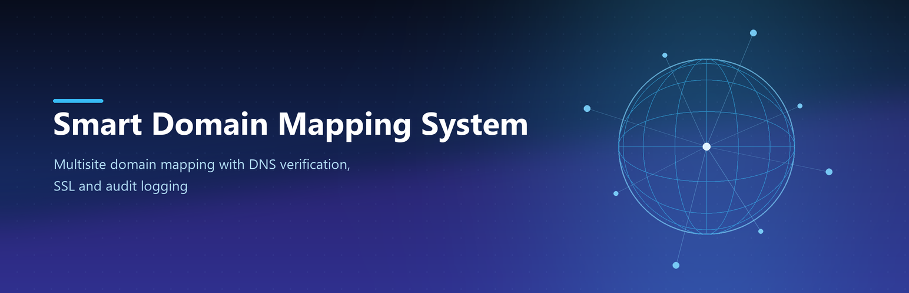

# Smart Domain Mapping System

[](https://github.com/cromstel/smart-domain-mapping-system/actions/workflows/ci.yml)
[](https://github.com/cromstel/smart-domain-mapping-system/actions/workflows/release.yml)
[](LICENSE.txt)

Multisite custom domain mapping for WordPress. Mappings live in `wp_sitemeta`
(Mercator-style), resolve through core's `wp_blogs.domain`, and are backed by DNS
verification, SSL certificate lifecycle tracking, an audit log and a REST API.

- **Requires:** WordPress 6.4+ (multisite) and PHP 8.1+
- **No `sunrise.php`**, no drop-ins, no early bootstrap hacks
- **Network Admin UI**, **WP-CLI** (`wp dm`) and a **REST API** (`domain-mapping/v1`)
- **Local audit logging only** — no telemetry ever leaves the server

## How it works

WordPress resolves a request's domain before plugins load, so this plugin does not
intercept bootstrap. Instead:

1. Mappings are stored in `wp_sitemeta` under `dm_domain_{domain}` keys.
2. Promoting a mapping to **primary** writes the domain into `wp_blogs.domain`
   via `wp_update_site()` (the same mechanism as the Network Admin *Site Address*
   field), so **core resolves it natively**.
3. Alias (non-primary) domains are stored, verified and audited here; point them
   at the primary domain at the DNS / web-server layer.

Verification, certificate and audit data live in three custom tables created with
`dbDelta()`: `dm_verifications`, `dm_certificates` and `dm_audit_log`.

See [`docs/API.md`](docs/API.md) for the full REST and WP-CLI
contract.

## Installation

1. Download `smart-domain-mapping-system-<version>.zip` from the
   [latest release](https://github.com/cromstel/smart-domain-mapping-system/releases/latest).
2. Upload the plugin folder to `wp-content/plugins/` (or install the ZIP from
   *Network Admin → Plugins → Add New*).
3. **Network activate** the plugin.
4. Go to *Network Admin → Domain Mapping* to add and manage mappings.

## Quick reference

```bash
# WP-CLI (run from the WordPress root)
wp dm mapping add <blog-id> <domain> [--primary]
wp dm mapping list
wp dm mapping enable|disable|remove <id>
wp dm mapping verify <id>
wp dm cert issue|renew <blog-id> <domain>
wp dm audit tail
wp dm migrate
```

```
GET    /wp-json/domain-mapping/v1/mappings
POST   /wp-json/domain-mapping/v1/mappings
GET    /wp-json/domain-mapping/v1/mappings/(?P<id>\d+)
PATCH  /wp-json/domain-mapping/v1/mappings/(?P<id>\d+)
DELETE /wp-json/domain-mapping/v1/mappings/(?P<id>\d+)
POST   /wp-json/domain-mapping/v1/verify
POST   /wp-json/domain-mapping/v1/primary
```

## Privacy

All data (mappings, verification challenges, certificates, audit entries) is
stored **locally** in your own database. The plugin never transmits data to
CITGROUP or any third party. Verification performs outbound HTTP/DNS lookups
against the domain being mapped — that is the only external network request.
See [`readme.txt`](readme.txt) for details.

## Development

```bash
composer install                 # PHPCS/WPCS + PHPUnit (dev tooling)
composer lint                    # WordPress Coding Standards + PHPCompatibility
composer test                    # PHPUnit (requires WP_TESTS_DIR + WP_MULTISITE=1)

# Package a production ZIP (same script CI uses)
pwsh bin/build-zip.ps1           # -> smart-domain-mapping-system-<version>.zip
```

See [`CONTRIBUTING.md`](CONTRIBUTING.md) for the full setup,
test and release workflow.

## Security

Please read [`SECURITY.md`](SECURITY.md) before reporting a
vulnerability — do **not** open a public issue for security defects.

## License

GPL-2.0-or-later. See [`LICENSE.txt`](LICENSE.txt).

---

Author: [CITGROUP](https://cromstelit.com)
